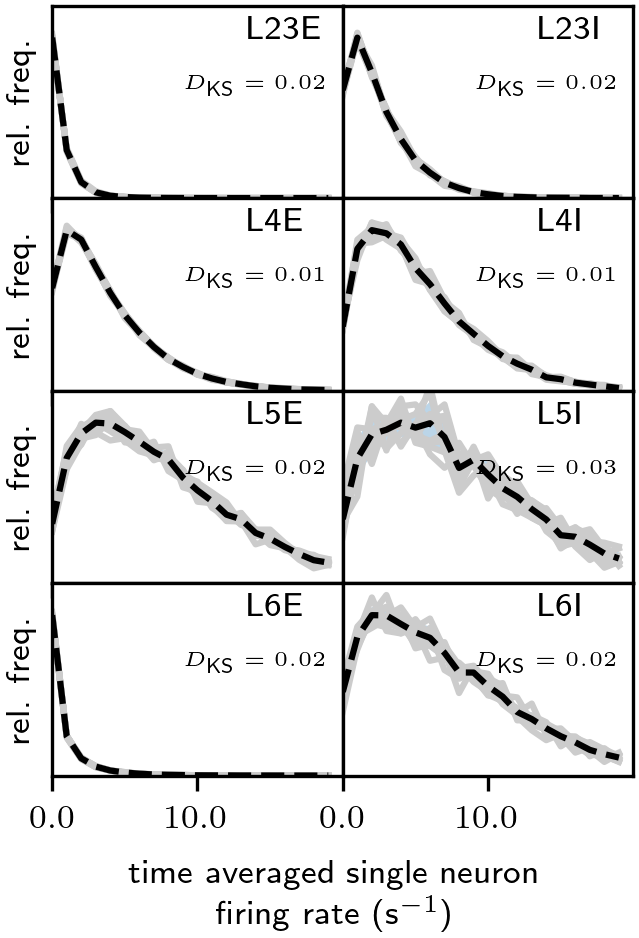
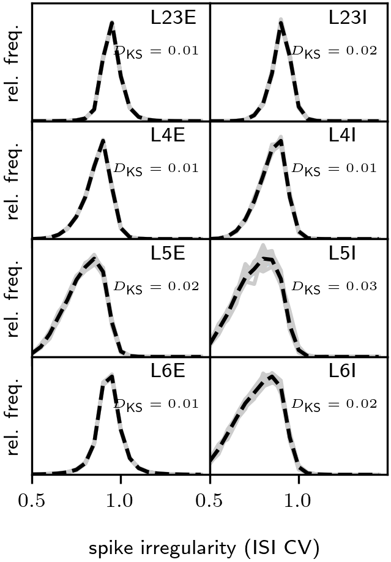
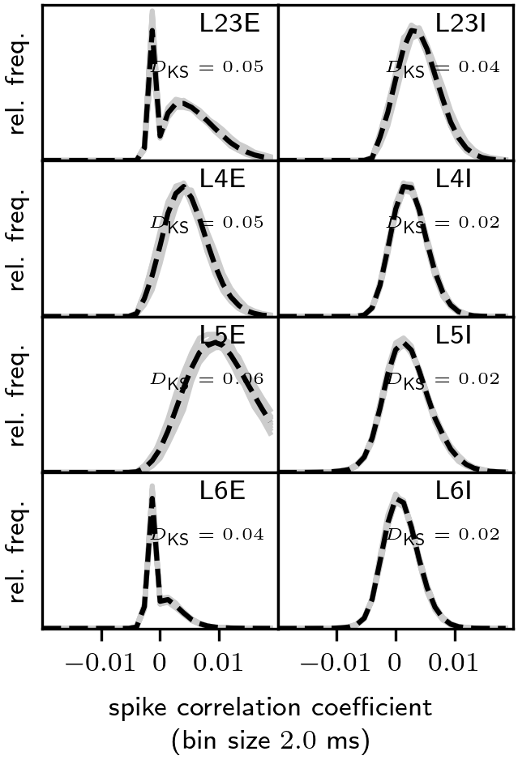
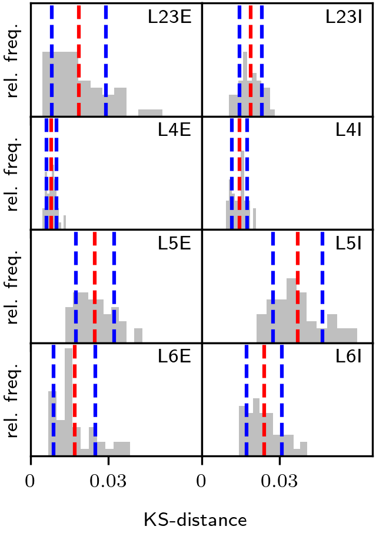
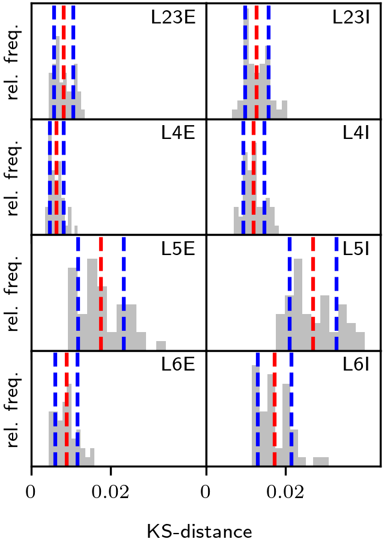
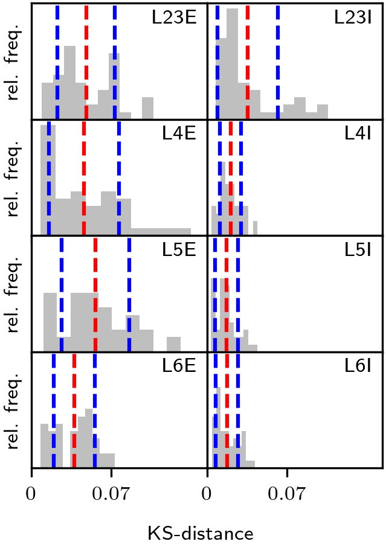

# Reference data

## Data generation
The data generation is exemplified in [`generate_reference_data.py`](generate_reference_data.py):
* has integrated two arguments as commands from the terminal:
  * `--seed`: updates the parameter `rng_seed` in [`sim_params.py`](../src/microcircuit/sim_params.py) which ensures reproducibility of the experiment
  * `--path`: updates the parameter `data_path` in [`sim_params.py`](../src/microcircuit/sim_params.py) to ensure correct data storage (without overwriting simulations with different seeds)
Here, we simulate the microcircuit with default parameters (in [source](../src/microcircuit/)) for changed simulation time $`T = 900`$s and for ten different RNGseeds, controlled by [`params.py`](params.py).
The data is stored during the simulation process in text files (`.dat`) in the general tree-structure `data/data_T<sim_time_in_s>s/seed-<RNGseed>/`:
* spiking data in `spike_recorder-7717<population-id>-<thread-id>.dat`:
  
|  |  |
|--|--|
| sender id | spike time in ms|

* nodes IDs in `nodes.json`:

```
{
    population-label: neuron-id
    }
```

* parameters `sim_dict.json`, `net_dict.json`, and `stim_dict.json`:

```
{
    parameter-label: value
    }
```


## Data analysis
In [`analyze_reference_data.py`](analyze_reference_data.py) one finds an example implementation of the analysis of statistics within one single realization of the network:
* calculates spike statistics (time averaged single neuron firing rates and ISI CVs for each neuron, and spike count correlation coefficients for a subset of 250 neurons) in each population for ten different network realizations.
* has integrated two arguments as commands from the terminal:
  * `--seed`: updates the parameter `rng_seed` in [`sim_params.py`](../src/microcircuit/sim_params.py) which ensures reproducibility of the experiment.
  * `--path`: updates the parameter `data_path` in [`sim_params.py`](../src/microcircuit/sim_params.py) to ensure correct data storage (without overwriting simulations with different seeds).

In [compute_ensemble_stats.py](compute_ensemble_stats.py) one finds an example implementation of the analysis of ensemble statistics comparing different realizations of the network:
* concatenates the data from all seeds for ensemble analysis.
* calculates distributions of spike statistics for each population and each network realization
* calculates Kolmogorov-Smirnoff (KS) distances for each pair of network realizations

The exact analysis follows the paper [Dasbach et al., 2021](https://doi.org/10.3389/fnins.2021.757790), for more infromation on the exact methods please refere to it.


## Data visualization
In [plot_reference_analysis.py](plot_reference_analysis.py) one finds an example implementation to plot the reference analysis done by the other scripts:
* plot distributions of spike statistics for each population and each network realization
  * additionaly, it computes the mean and standard deviated distribution over seeds for each population.

| sim time |rate | ISI CV | CC |
|--|--|--|--|
| $`T = 900`$s |  |  |  |

* plot distributions of KS distances across pairs of network realizations for each spike statistics and each population
  * the idea is that the user can compare own implementations of the model and compute the KS distance of his own distributions to the reference implementation to ensure that it falls within the bounds of the reference distributions of the KS histograms
  * additionaly, it computes the mean and standard deviation of the distribution for each population.

| sim time |rate | ISI CV | CC |
|--|--|--|--|
| $`T = 900`$s |  |  |  |

## Cluster submission workflow
Specific for slurm queing system:
* [`env.sh`](cluster_submission/env.sh):
  * contains the necessary modules to be loaded and path to source an environment containing the `microcircuit-package` (see [installation README](../README.md)) on the local cluster
* [`run_benchmark.sh`](cluster_submission/run_benchmark.sh):
  * contains the workflow to submit ten parallel jobs on the cluster, each with a different realization of the network
* [`run_job.sh`](cluster_submission/run_job.sh):
  * contains the bash command to start the simulation for each job and run the analysis per seed after simulation's end
  * it also contains specifications about the necessary resources


